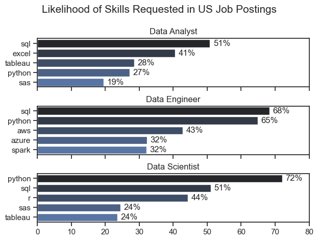
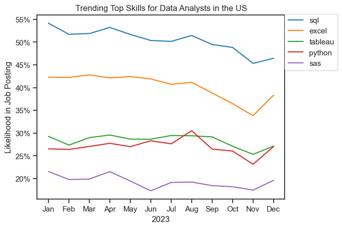
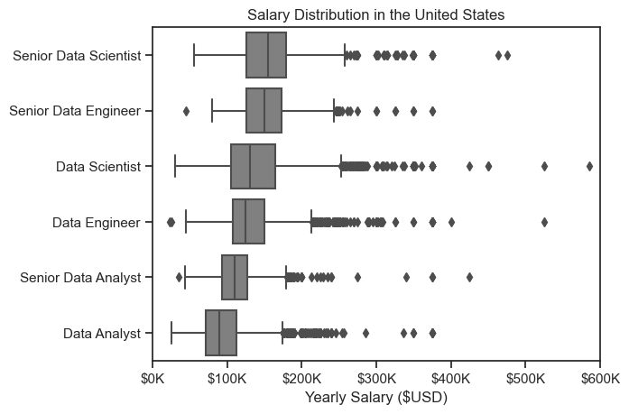
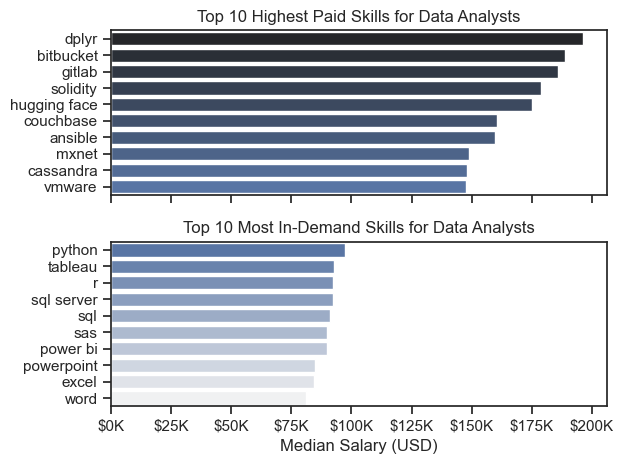
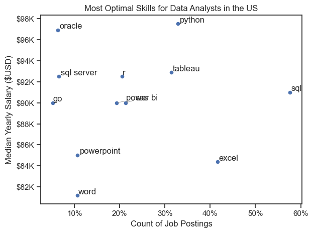

# Overview
Welcome to my analysis of the data job market, focusing on data analyst roles. This project was created out of a desire to navigate and understand the job market more effectively. It delves into the top-paying and in-demand skills to help find optimal job opportunities for data analysts.
The data sourced from Luke Barousse's Python Course which provides a foundation for my analysis, containing detailed information on job titles, salaries, locations and essential skills. Through a series of Python scripts, I explore key questions such as the most demanded skills, salary trends, and the intersection of demand and salary in data analytics.

### The Questions
1. What are the most demanded skills for the top 3 most popular data roles?
2. How are in-demand skills trending for Data Analysts?
3. How well do jobs and skills pay for Data Analysts?
4. What is the most optimal skill to learn for Data Analysts? (High Demand AND High Paying)

### Tools I Used
For my deep dive into the data analyst job market, I harnessed the power of several key tools:

**Python**: The backbone of my analysis, allowing me to analyze the data and find critical insights. I also used the following Python libraries:
	<li> **Pandas Library**: This was used to analyze the data
	<li> **Matplotlib Library**: I visualized the data
	<li> **Seaborn Library**: Helped me create more advanced visuals.

**Jupyter Notebooks**: The tool I used to run my Python scripts which let me easily include my notes and analysis

**Git & GitHub**: Essential for version control and sharing my Python code and analysis, ensuring collaboration and 

### Data Preparation and Cleanup
This section outlines the steps taken to prepare the data for analysis, ensuring accuracy and usability.

### Import and Clean Up Data
I started by importing the necessary libraries and leading the dataset, followed by initial data cleaning tasks to ensure data useful.

# The Analysis

## 1. What are the most demanded skills for the top 3 most popular data roles?

To find the most demanded skills for the top 3 most popular data roles. I filtered out those positions by which ones were the most popular, and got the top 5 skills for these top 3 roles. This query highlights the most popular job titles and their top skills, showing which skills I should pay attention to dependin on the role I'm targetting.
View my notebook with detailed steps here: [ANALYZING_TOP_PAYING_ROLES.ipynb](ANALYZING_TOP_PAYING_ROLES.ipynb)
### Visualize Data
```python
# plot the values again with seaborn
fig, ax = plt.subplots(len(job_titles), 1, sharex = True)

for i, job_title in enumerate(job_titles):
    df_plot = df_skills_pec[df_skills_pec['job_title_short'] == job_title].head()
    sns.barplot(data = df_plot,
               y  = 'job_skills', 
               x = 'skill_percent',
               palette = 'dark:b',
               ax = ax[i])
    # Adjust chart parameters
    ax[i].set_title(job_title)
    ax[i].set_ylabel('')
    ax[i].set_xlabel('')
    ax[i].set_xlim(0,80)
    
    # Add value labels on the charts
    for n, v in enumerate(df_plot['skill_percent']):
        ax[i].text(v+1, n, 
                   f'{v:.0f}%',
                  va = 'center')
    # Adjust plot layout
    fig.tight_layout(h_pad = 0.5)
    fig.suptitle('Likelihood of Skills Requested in US Job Postings',
                fontsize = 15)
    
```
### Results



### Insights
 - SQL is a highly sought after skill across all 3 roles. It appears as either first for Data Analysts(51%) and Data Engineers (68%) then second for Data Scientists(51%).
 - Python is equally a versatile skill as it appears first for Data Scientists (72%) and Data Engineers (65%), however, it only ranks fourth for Data Analysts (27%).
 - Data Engineers use more specialized tools (AWS, Azure, Spark) which are uncommon to Data Analysts and Data Scientiest. Data Analysts appear to differ with Data Scientists in the use of Excel (41%) while Data Scientists in return differ with the use of R.

## 2. How are in-demand skills trending for Data Analysts?

### Visualize Data
```python
# get the first five columns
df_plot = df_DA_US_percent.iloc[:,:5]

sns.set_theme(style = 'ticks')
sns.lineplot(data = df_plot,
            dashes = False,
            palette='tab10')

plt.title('Trending Top Skills for Data Analysts in the US')
plt.ylabel('Likelihood in Job Posting')
plt.xlabel('2023')
plt.legend(loc = [1,0.7])

# format the y axis
from matplotlib.ticker import PercentFormatter
ax = plt.gca()
ax.yaxis.set_major_formatter(PercentFormatter(decimals = 0))

```
### Results



### Insights
- SQL remains the most consistently demanded skill throughout the year, although it shows a gradual decrease in demand.
- Excel experienced a significant increase in demand starting around September, surpassing both python and Tableau by the end of the year.
- Both Python and Tableau show relatively stable demand through out the year with little fluctuation. however, they remain essential skills. 
- SAS is the least demanded skill among the top skills but equally fluctuates between March and July as well as at the end of the year.

## 3. How well do jobs and Skills pay for Data Analysts?

## Salary Analysis for Data Nerds

### Visualize Data

```python
# plot the acquired job roles by their median salary
# Creating an order of the job titles
order_median = df_US_top6.groupby('job_title_short')['salary_year_avg'].median().sort_values().index

# Create the boxplot with the ordered axis
sns.boxplot(data = df_US_top6,
           x = 'salary_year_avg',
           y = 'job_title_short'
           , order = order_median
           , color = 'gray')
plt.title('Salary Distribution in the United States')
plt.xlabel('Yearly Salary ($USD)')
plt.ylabel('')
plt.xlim(0,600000)
# modify the x axis
ax = plt.gca()
ax.invert_yaxis()
ax.xaxis.set_major_formatter(plt.FuncFormatter(lambda x, pos: f'${int(x/1000)}K'))
plt.show()
```

### Results


### Insights
- There is a significant variation in salary ranges across different job titles. Senior Data Scientist positions tend to have the highest salary potential, with up to $600K, indicating the the high value placed on advanced data skills and experience in the industry.
- Senior Data Engineer and Senior Data Scientist roles show a considerable number of outliers on the higher end of the salary spectrum, suggesting that exceptional skills for circumstances can lead to high pay in these roles. In contrast, Data Analyst roles demonstrate more consistency in salary, with few outliers.
- The median salaries increase with the seniority and specialization of the roles. Senior roles (Senior Data Scientis, Senior Data Engineer) not only have higher median salaries but also larger differences in typical salaries, reflecting greater variance in compensation as responsibilities increase.

## Highest Paid & Most Demanded Skills for Data Analysts
### Visualize Data
```python
# plot the values on the same figure usin seaborn
# create figure and axis
plt.figure(figsize = (15,10))
fig, ax = plt.subplots(2, 1, sharex = True)

# Plot for Top 10 highest paid skills
# (df_DA_top_pay[::-1].plot(kind = 'barh', y = 'median', ax = ax[0]))

sns.barplot(data = df_DA_top_pay,
            x = 'median',
           y = df_DA_top_pay.index,
           ax = ax[0],
           #hue = 'median',
           palette= 'dark:b')
ax[0].set_title('Top 10 Highest Paid Skills for Data Analysts')
ax[0].set_ylabel('')
ax[0].set_xlabel('')
ax[0].xaxis.set_major_formatter(plt.FuncFormatter(lambda x, pos: f'${int(x/1000)}K'))
ax[0].legend().remove()

# Plot for Top 10 Most in demand skills
# (df_DA_skills[::-1].plot(kind  = 'barh', y = 'median', ax = ax[1]))
sns.barplot(data = df_DA_skills,
            x = 'median',
            y = df_DA_skills.index,
            #hue = 'median',
            palette = 'light:b_r',
            ax = ax[1])
ax[1].set_title('Top 10 Most In-Demand Skills for Data Analysts')
ax[1].set_ylabel('')
ax[1].set_xlabel('Median Salary (USD)')
ax[1].xaxis.set_major_formatter(plt.FuncFormatter(lambda x, pos: f'${int(x/1000)}K'))
ax[1].legend().remove()

# set the limit of the second chart to match of the first
ax[1].set_xlim(ax[0].get_xlim()) 

# adjust layout to prevent overlap
fig.tight_layout()
plt.show()
```
### Results


### Insights
- The top graph shows specialized technical skills like 'dplyr', `Bitbucket`, and `Gitlab` are associated with higher salaries, some reaching up to $200k, suggesting that advanced technical proficiency can increase earning potential.
- The bottom graph highlights that foundational skills like `Excel`, `PowerPoint`, and `SQL` are the most in-demand, even though they may not offer the highest salaries. This demonstrates the importance of these core skills for employability in data analysis roles.
- There's a clear distinction between the skills that are highest paid and those that are most in-demand. Data analysts aiming to maximize thier career potential should consider developing a diverse skill set that includes both high-paying specialized skills and widely demanded foundational skills.

## What is the Most Optimal Skill to learn for Data Analysts?
### Visualize Data
```python
from adjustText import adjust_text
# changing the y ticks
# fig, ax = plt.subplots() or


sns.scatterplot(
    data = df_plot,
    x = 'skill_percent',
    y = 'median_salary',
    hue = 'technology')

sns.despine()
sns.set_theme(style = 'ticks')


text = []
for i, txt in enumerate(df_plot['skills']):
    text.append(plt.text(df_plot['skill_percent'].iloc[i],
            df_plot['median_salary'].iloc[i], txt))
    
#     Add arrows to the labels of the dots
adjust_text(text,
            arrowprops  = dict(arrowstyle = "->",
                               color = 'gray', 
                               lw = 0.5))

    # Setting the y axis into short form values
ax = plt.gca()
ax.yaxis.set_major_formatter(
    plt.FuncFormatter(
        lambda y, pos: f'${int(y/1000)}K'))
# Set x axis to percent values
from matplotlib.ticker import PercentFormatter
ax.xaxis.set_major_formatter(PercentFormatter(decimals = 0))

plt.xlabel('Count of Job Postings')
plt.ylabel('Median Yearly Salary ($USD)')
plt.title('Most Optimal Skills for Data Analysts in the US')
plt.tight_layout()
plt.show()
```
### Results


#### Insights
- The scatter plot shows that most of the `programming` skills (coloured blue) tend to cluster at higher salary levels compared to other categories, indicating that programming expertise might offer greater salary benefits within the analytical field.
- Analyst tools (coloured orange), including Tableau and Power Bi, are prevalent in job postings and offer competitive salaries, showin that visualization and data analysis software are crucial for current dataroles. This category not only has good salaries but is also versatile across different types of data tasks.
- The database skills (coloured green or red), such as Oracle and SQL Server, are associated with some of te highest salaries among data analyst tools. This indicates a significant demand and valuation for data management and manipulation expertise in the industry.

# What I Learned
Throughout this project, I deepened my understanding of the data analyst job market and enhanced my technical skills in python, especially in data manipulation and data visualization. Here are a few specific things I learned
- Advanced Python Usage: Utilizing libraries such as Pandas for data manipulation, Seaborn and Matplotlib for data visualization, and other libraries helped me perform complex data analysis tasks more efficiently.
- Data Cleaning Importance: I learned that thorough data cleaning and preparation are crucial before any analysis can be conducted, ensuring the accuracy of insights derived from the data
- Strategic Skill Analysis: The project emphasized the importance of aligning one's skills with market demand. Understanding the relationship between skill demand, salary, and job availability allows for more strategic career planning in the tech industry.

# Insights
This project provided several general insights into the data job market for analysts:
- Skill Demand and Salary Correlation: There is a clear correlation between the demand for specific skills and the salaries these skills command. Advanced and specialized skills like Python and Oracle often lead to higher salaries.
- Market Trends: There are changing trends in skill demand, highlighting the dynamic nature of the data job market. Keeping up with these trends is essential for career growth in data analytics. 
- Economic Value of Skills: Understanding which skills are both in-demand and well-compensated can guide data analysts in prioritizing learning to maximize their economic returns.

# Challenges I Faced
This project was not without its challenges, but it provided good learning opportunities:
- Data Inconsistences: Handling missing or inconsistent data entries requires careful consideration and thorough data cleaning techniques to ensure the integrity of the analysis.
- Complex Data Visualization: Designing effective visual representation of complex datasets was challenging but critical for conveying insights clearly and compellingly.
- Balancing Breadth and Depth: Deciding how deeply to dive into each analysis while maintaining a broad overview of the data landscape required constant balancing to ensure comprehensive coverage without getting lost in details.

# Conclusion
This exploration into the data analyst job market has been incredibly informative, highlighting the critical skills and trends that shape this evolving field. The insights I got enhance my understanding and provide actionable guidance for anyone looking to advance their career in data analytics. As the market continues to change, ongoing analysis will be essential to stay ahead in data analytics. This project is a good foundation for future explorations and underscores the importance of continuous learning and adaption in the data field.
